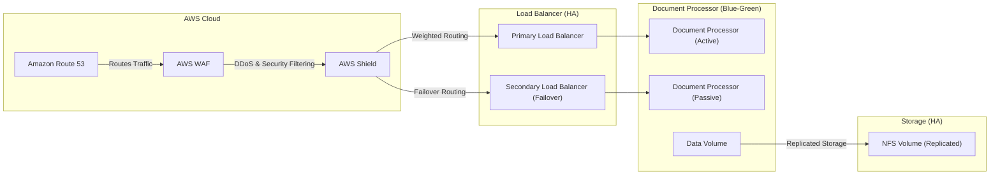

### **🚀 HA Implementation Summary**

#### **1️⃣ Load Balancer Enhancement**
🔹 Upgrade to **HA Load Balancers** (e.g., AWS ALB/NLB).

#### **2️⃣ Active-Passive Deployment (Blue-Green)**
🔹 Deploy a **secondary Document Processor** (passive).  
🔹 **Gradual traffic shift** ensures **zero downtime** & quick rollback.

#### **3️⃣ Route 53 Weighted Routing**
🔹 **Distribute traffic** between clusters, increasing gradually.

#### **4️⃣ Storage HA & Backup**
🔹 Enhance **NFS Volume replication & backup**.  
🔹 Consider **AWS EFS** for durability.

---

### **🗺️ HA Architecture**

---

### **🔹 Key Benefits**
✅ **Zero Downtime** via Blue-Green strategy.  
✅ **Automatic Failover** ensures reliability.  
✅ **Scalability-Ready** for future Kubernetes adoption.  
✅ **Data Redundancy** reduces loss risks.