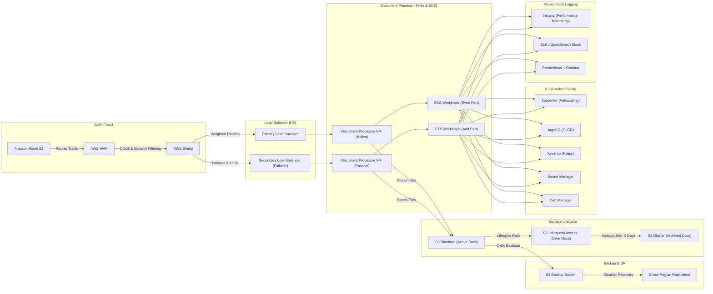

## **🚀 HA & Migration Plan**

### **🔹 Phase 1: High Availability (HA) Setup**
✅ Route 53, AWS WAF & Shield for traffic management and security.  
✅ Duplicate Document Processor VM & Load Balancer for HA.  
✅ Zero Downtime Rollouts using Blue-Green Deployment.

### **🔹 Phase 2: Storage Migration**
✅ Migrate NFS to S3 with lifecycle rules and backups.

### **🔹 Phase 3: Containerization**
✅ Dockerize applications while keeping them in VMs.

### **🔹 Phase 4: Migration to EKS (Even Part Only)**
✅ Deploy **first EKS cluster + Kong API Gateway**.

### **🔹 Phase 5: **Monitoring & Logging Implementation**
✅ Deploy **ELK (or OpenSearch) for log aggregation**.  
✅ Set up **Instana** for performance monitoring.  
✅ Enable **Kubernetes native monitoring** (Prometheus + Grafana).

### **🔹 Phase 6: Kubernetes Optimization**
✅ Implement:
- **Karpenter** (autoscaling)
- **ArgoCD** (GitOps-based CI/CD)
- **Kyverno** (policy enforcement)
- **Secret Manager** (secure credentials)
- **Cert Manager** (TLS certificates)

### **🔹 Phase 7: Full EKS Migration (Add Part)**
✅ Migrate remaining workloads to **EKS + Kong**.

### **🔹 Phase 8: Advanced Monitoring & Security**
✅ Fine-tune **ELK/OpenSearch + Instana + Prometheus + Grafana**.  
✅ Improve security policies via Kyverno & AWS Shield.

### **🔹 Phase 9: Dynamic EKS Cluster Management**
✅ Develop **mechanism to shut down and start EKS clusters dynamically** to optimize costs.

---

## **🗺️ Updated EKS & Monitoring Architecture**

---

## **🔹 Key Benefits**
✅ **Zero Downtime** via HA Load Balancers & Blue-Green Strategy.  
✅ **Scalable Storage** using S3 with lifecycle policies.  
✅ **Full Observability** with **Instana, ELK/OpenSearch, Prometheus & Grafana**.  
✅ **Seamless Migration** from VMs → EKS with phased rollout.  
✅ **Cost Optimization** via auto-scaling (Karpenter) & EKS shutdown mechanism.  
✅ **Enhanced Security** via AWS WAF, Shield, Kyverno & Secret Manager.

---
