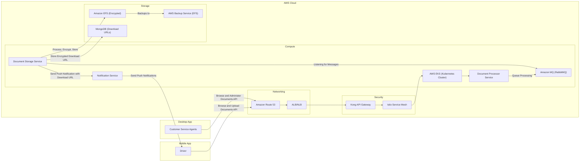
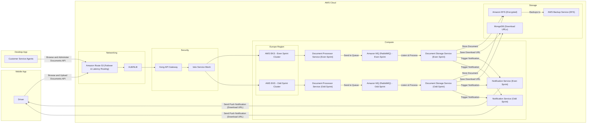

## **🦜 Proposed Architecture for the Document Processor System**

| **Challenge**                  | **Proposed Solution**                                                                                                                                                                                                                                            |
|--------------------------------|------------------------------------------------------------------------------------------------------------------------------------------------------------------------------------------------------------------------------------------------------------------|
| **Scalability & Performance**  | ✅ Migrate to **AWS EKS** for Kubernetes-based auto-scaling (**Karpenter**)   ✅ Use **RabbitMQ** for asynchronous processing |
| **Traffic Control & Routing**  | ✅ Use **Amazon Route 53** for **failover & latency-based routing** |
| **Storage & Data Security**    | ✅ Store documents in **Amazon EFS** (scalable, low latency)   ✅ **Encrypt documents** for security and compliance |
| **Security & Compliance**      | ✅ Implement **Kong API Gateway** for authentication & rate limiting |
| **Reliability & Fault Tolerance** | ✅ Use **Route 53 failover** for high availability   ✅ Implement **AWS Backup Service** for EFS backups |
| **Deployment & Release Risks** | ✅ Adopt **Canary & Blue-Green Deployments** for safer rollouts and minimal downtime |
| **Containerization & Portability** | ✅ **Dockerize applications** for consistency across environments   ✅ Deploy containers using **Amazon EKS** for managed **Kubernetes orchestration** |
| **Service Mesh & Observability** | ✅ Integrate **Istio Service Mesh** for traffic management, security, and observability |
| **Mobile Notifications**       | ✅ Add **NotificationService** to send notifications to the mobile app via **Firebase Cloud Messaging (FCM)** |

---

### **📞 Architecture Diagram**

#### **Single EKS Cluster with Istio Service Mesh**

---

### **Process Flow**

1. **Drivers & Agents** interact with the system through **Amazon Route 53** and **Kong API Gateway**.
2. **Document Processor Service** receives document upload requests and pushes processing tasks to **Amazon MQ (RabbitMQ)**.
3. **Document Storage Service** listens for messages from **Amazon MQ**, processes documents, encrypts them, and stores them in **Amazon EFS**.
4. **Document Storage Service** stores the encrypted document’s **download URL** in **MongoDB**.
5. Once the document is stored, **Document Storage Service** sends a push notification to the mobile app via **Firebase Cloud Messaging (FCM)**.
6. Users receive a notification with a **download link** to access the stored document.
7. **AWS Backup Service** ensures periodic backups of **Amazon EFS** for disaster recovery.

---

### **✅ Key Benefits**

- **Highly Scalable**: Uses **Kubernetes auto-scaling** via **AWS EKS** and **Karpenter**.
- **Efficient Traffic Management**: Powered by **Amazon Route 53**, **ALB**, and **Istio Service Mesh**.
- **Secure & Compliant**: Encryption, **Kong API Gateway**, and **EFS encryption** ensure data security.
- **Reliable & Fault-Tolerant**: Uses **Amazon MQ** for async processing, **AWS Backup Service** for redundancy.
- **Mobile-Friendly**: Supports **Firebase Cloud Messaging** for instant user notifications.

---

#### ** Dual EKS Clusters per Sprint with Istio Service Mesh **

---

### **📊 Feature Comparison**

| **Feature**                     | **Approach 1 (Single EKS Cluster with Istio)** | **Approach 2 (Dual EKS Clusters with Istio per Sprint)** |
|----------------------------------|--------------------------------------------|---------------------------------------------|
| **Traffic Control**              | ✅ Amazon Route 53 (low cost)              | ✅ Amazon Route 53 (low cost)               |
| **Load Balancing**               | ✅ AWS ALB/NLB (scalable, pay-as-you-go) | ✅ AWS ALB/NLB (scalable, pay-as-you-go)   |
| **Security**                     | ✅ Kong API Gateway (moderate cost) | ✅ Kong API Gateway (higher due to 2 clusters) |
| **Compute (Execution Environment)** | ✅ Single AWS EKS Cluster (scalable, efficient cost) | ✅ Two AWS EKS Clusters (double EKS cost) |
| **Deployment Strategy**          | ✅ ArgoCD + Argo Rollouts (low additional cost) | ✅ ArgoCD (low cost, no Argo Rollouts) |
| **Scalability (Karpenter)** | ✅ Kubernetes-based auto-scaling (efficient cost) | ✅ Kubernetes-based auto-scaling (higher cost due to 2 clusters) |
| **Sprint-Based Deployment**      | ❌ Single cluster handles all sprints     | ✅ One EKS for even sprints, one for odd (higher infra cost) |
| **Async Processing**             | ✅ RabbitMQ (low cost per message processed) | ✅ Separate RabbitMQ per cluster (higher due to duplication) |
| **Backup Strategy**              | ✅ **AWS Backup Service for EFS** (more secure) | ✅ **AWS Backup Service for EFS** (more secure) |
| **High Availability (HA)**       | ✅ Kubernetes redundancy & failover       | ✅ Multi-cluster redundancy (even/odd) (higher cost) |
| **Resilience & Fault Tolerance** | ✅ Kubernetes cluster self-healing        | ✅ Two independent clusters for resilience |
| **Service Mesh (Istio)**         | ✅ Centralized traffic control, observability, security | ✅ Separate Istio instances for each cluster (higher cost) |
| **Mobile Notifications**         | ✅ Notification Service with **Firebase** | ✅ Notification Service with **Firebase** (higher cost due to duplication) |
| **Cost Consideration 💰**        | 💲 **Optimized (Single EKS, scalable, moderate cost)** | 💲💲 **Higher (2x EKS clusters, better isolation)** |

---
