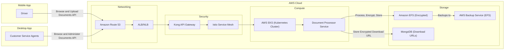
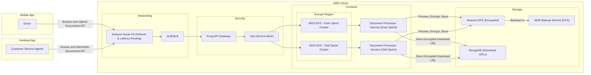

## **🦜 Proposed Architecture for the Document Processor System**

| **Challenge**                  | **Proposed Solution**                                                                                                                                                                                                                                            |
|--------------------------------|------------------------------------------------------------------------------------------------------------------------------------------------------------------------------------------------------------------------------------------------------------------|
| **Scalability & Performance**  | ✅ Migrate to **AWS EKS** for Kubernetes-based auto-scaling (**Karpenter**) <br> ✅ Use **RabbitMQ** for asynchronous processing |
| **Traffic Control & Routing**  | ✅ Use **Amazon Route 53** for **failover & latency-based routing** |
| **Storage & Data Security**    | ✅ Store documents in **Amazon EFS** (scalable, low latency) <br> ✅ **Encrypt documents** for security and compliance |
| **Security & Compliance**      | ✅ Implement **Kong API Gateway** for authentication & rate limiting |
| **Reliability & Fault Tolerance** | ✅ Use **Route 53 failover** for high availability <br> ✅ Implement **AWS Backup Service** for EFS backups |
| **Deployment & Release Risks** | ✅ Adopt **Canary & Blue-Green Deployments** for safer rollouts and minimal downtime |
| **Containerization & Portability** | ✅ **Dockerize applications** for consistency across environments <br> ✅ Deploy containers using **Amazon EKS** for managed **Kubernetes orchestration** |
| **Service Mesh & Observability** | ✅ Integrate **Istio Service Mesh** for traffic management, security, and observability |

---

### **📞 Architecture Diagram**

#### **(Single EKS Cluster with Istio Service Mesh)**



#### **(Dual EKS Clusters per Sprint with Istio Service Mesh)**


Here's an enhanced **Dual EKS Cluster (Even/Odd) Approach** architecture diagram including **traffic weight shifting and deployment strategy**:

---

### **🚀 Dual EKS Cluster (Even/Odd) Approach with Traffic Weight Shifting & Deployment Strategy**

```mermaid
graph TD;
  
  subgraph AWS_Cloud
    subgraph Networking
      A[Amazon Route 53] -->|Failover & Latency Routing| B[ALB/NLB]
    end
    
    subgraph Security
      C[Kong API Gateway] -->|Auth, Rate Limiting| D[AWS WAF]
      D -->|DDoS Protection| E[AWS Shield]
    end

    subgraph Compute
      subgraph Europe_Region
        F1[AWS EKS - Even Sprint Cluster] -->|Containerized Backend| G1[Dockerized Microservices (Even)]
        F2[AWS EKS - Odd Sprint Cluster] -->|Containerized Backend| G2[Dockerized Microservices (Odd)]
        
        G1 -->|Async Processing| H1[RabbitMQ (Even)]
        G2 -->|Async Processing| H2[RabbitMQ (Odd)]
        
        F1 & F2 -->|Dynamic Node Scaling| K[Karpenter Auto-Scaling]
        
        subgraph "Traffic Weight Shifting"
          P1["Current Traffic: 90% → Odd Cluster"] 
          P2["Canary Deployment: 10% → Even Cluster"]
          P3["Full Rollout: 100% → Even Cluster"]
          
          P1 -->|Gradual Increase| P2
          P2 -->|Success?| P3
        end
      end
    end

    subgraph Storage
      I[AWS EFS] -->|Encrypted Storage| J[Data Lake / Documents]
      J -->|Automated Backups| K[AWS Backup Service]
    end

    subgraph Deployment
      L[CI/CD Pipeline] -->|Triggers Deployment| M[ArgoCD]
      M -->|Deploys to Even Sprint Cluster| F1
      M -->|Deploys to Odd Sprint Cluster| F2
      
      subgraph "Even/Odd Deployment Strategy"
        N1["Current Sprint → Odd Cluster"]
        N2["Upcoming Sprint → Deploy to Even Cluster"]
        N3["Traffic Shifting → Gradual 10%-50%-100%"]
        N4["Odd Cluster Becomes Idle"]
        
        N1 --> N2
        N2 --> N3
        N3 -->|Success?| N4
      end
    end
  end
  
  A -->|Traffic Control| C
  B -->|Routes Traffic| F1 & F2
  C --> B
  F1 & F2 --> I

```

---

### **📌 Key Enhancements**
✅ **Traffic Weight Shifting**: Gradually shifting traffic (10% → 50% → 100%) to the **new cluster** before decommissioning the old one.  
✅ **Even/Odd Sprint Strategy**: Every sprint deploys to a **new EKS cluster**, keeping the previous cluster in **standby** until the transition is complete.  
✅ **Karpenter Auto-Scaling**: Ensures each cluster **scales dynamically** based on workload demands.  
✅ **AWS Backup Service**: Automates backups for **EFS data** instead of S3 for compliance and security.  
✅ **ArgoCD for Canary Deployments**: Ensures **zero-downtime releases** while validating new changes before full rollout.

Would you like any additional refinements? 🚀
---

### **📊 Feature Comparison**

| **Feature**                     | **Approach 1 (Single EKS Cluster with Istio)** | **Approach 2 (Dual EKS Clusters with Istio per Sprint)** |
|----------------------------------|--------------------------------------------|---------------------------------------------|
| **Traffic Control**              | ✅ Amazon Route 53 (low cost)              | ✅ Amazon Route 53 (low cost)               |
| **Load Balancing**               | ✅ AWS ALB/NLB (scalable, pay-as-you-go) | ✅ AWS ALB/NLB (scalable, pay-as-you-go)   |
| **Security**                     | ✅ Kong API Gateway (moderate cost) | ✅ Kong API Gateway (higher due to 2 clusters) |
| **Compute (Execution Environment)** | ✅ Single AWS EKS Cluster (scalable, efficient cost) | ✅ Two AWS EKS Clusters (double EKS cost) |
| **Deployment Strategy**          | ✅ ArgoCD + Argo Rollouts (low additional cost) | ✅ ArgoCD (low cost, no Argo Rollouts) |
| **Scalability (Karpenter)** | ✅ Kubernetes-based auto-scaling (efficient cost) | ✅ Kubernetes-based auto-scaling (higher cost due to 2 clusters) |
| **Sprint-Based Deployment**      | ❌ Single cluster handles all sprints     | ✅ One EKS for even sprints, one for odd (higher infra cost) |
| **Async Processing**             | ✅ RabbitMQ (low cost per message processed) | ✅ Separate RabbitMQ per cluster (higher due to duplication) |
| **Backup Strategy**              | ✅ **AWS Backup Service for EFS** (more secure) | ✅ **AWS Backup Service for EFS** (more secure) |
| **High Availability (HA)**       | ✅ Kubernetes redundancy & failover       | ✅ Multi-cluster redundancy (even/odd) (higher cost) |
| **Resilience & Fault Tolerance** | ✅ Kubernetes cluster self-healing        | ✅ Two independent clusters for resilience |
| **Service Mesh (Istio)**         | ✅ Centralized traffic control, observability, security | ✅ Separate Istio instances for each cluster (higher cost) |
| **Cost Consideration 💰**        | 💲 **Optimized (Single EKS, scalable, moderate cost)** | 💲💲 **Higher (2x EKS clusters, better isolation)** |

---
