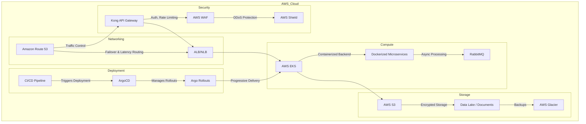

Here's the updated architecture incorporating **Dockerization of the backend**:

---

## **🛠️ Proposed Architecture for the Document Processor System**

| **Challenge**                  | **Proposed Solution**                                                                                                                                                                                                                                            |
|--------------------------------|------------------------------------------------------------------------------------------------------------------------------------------------------------------------------------------------------------------------------------------------------------------|
| **Scalability & Performance**  | ✅ Migrate to **AWS EKS** for Kubernetes-based auto-scaling (**Karpenter**) <br> ✅ Use **RabbitMQ** for asynchronous processing |
| **Traffic Control & Routing**  | ✅ Use **Amazon Route 53** for **failover & latency-based routing** |
| **Storage & Data Security**    | ✅ Store documents in **Amazon S3** (scalable, low latency) <br> ✅ **Encrypt documents** for security and compliance |
| **Security & Compliance**      | ✅ Implement **Kong API Gateway** for authentication & rate limiting <br> ✅ Deploy **AWS WAF** for malicious traffic filtering <br> ✅ **Enable DDoS protection** using **AWS Shield** and **Kong Ingress Gateway** (rate-limiting, bot-detection, IP restriction) |
| **Reliability & Fault Tolerance** | ✅ Use **Route 53 failover** for high availability <br> ✅ Implement **offsite backups** in **AWS S3/Glacier** |
| **Deployment & Release Risks** | ✅ Adopt **Canary & Blue-Green Deployments** for safer rollouts and minimal downtime |
| **Containerization & Portability** | ✅ **Dockerize applications** for consistency across environments <br> ✅ Deploy containers using **Amazon EKS** for managed **Kubernetes orchestration** |

---

### **🗺️ Architecture Diagram**

## **Approach 1: Single EKS Cluster**



## **Approach 2: Dual EKS Clusters (Even/Odd Sprints)**

```mermaid
graph TD;
  
  subgraph AWS_Cloud
    subgraph Networking
      A[Amazon Route 53] -->|Failover & Latency Routing| B[ALB/NLB]
    end
    
    subgraph Security
      C[Kong API Gateway] -->|Auth, Rate Limiting| D[AWS WAF]
      D -->|DDoS Protection| E[AWS Shield]
    end

    subgraph Compute
      subgraph Europe_Region
        F1[AWS EKS - Even Sprint Cluster] -->|Containerized Backend| G1[Dockerized Microservices (Even)]
        F2[AWS EKS - Odd Sprint Cluster] -->|Containerized Backend| G2[Dockerized Microservices (Odd)]
        G1 -->|Async Processing| H1[RabbitMQ (Even)]
        G2 -->|Async Processing| H2[RabbitMQ (Odd)]
      end
    end

    subgraph Storage
      I[AWS S3] -->|Encrypted Storage| J[Data Lake / Documents]
      J -->|Backups| K[AWS Glacier]
    end

    subgraph Deployment
      L[CI/CD Pipeline] -->|Triggers Deployment| M[ArgoCD]
      M -->|Deploys to Even Sprint Cluster| F1
      M -->|Deploys to Odd Sprint Cluster| F2
    end
  end
  
  A -->|Traffic Control| C
  B -->|Routes Traffic| F1
  B -->|Routes Traffic| F2
  C --> B
  F1 -->|Storage & Backup| I
  F2 -->|Storage & Backup| I


```

---

| **Feature**                     | **Initial Approach (Standalone VMs)**      | **Approach 1 (Single EKS Cluster)**        | **Approach 2 (Dual EKS Clusters per Sprint)** |
|----------------------------------|-------------------------------------------|--------------------------------------------|---------------------------------------------|
| **Traffic Control**              | ❌ No traffic routing                     | ✅ Amazon Route 53 (low cost)              | ✅ Amazon Route 53 (low cost)               |
| **Load Balancing**               | ✅ Standalone Load Balancer (VM) (medium cost) | ✅ AWS ALB/NLB (scalable, pay-as-you-go) | ✅ AWS ALB/NLB (scalable, pay-as-you-go)   |
| **Security**                     | ❌ Basic VM-based security                 | ✅ Kong API Gateway + AWS WAF & Shield (moderate cost) | ✅ Kong API Gateway + AWS WAF & Shield (higher due to 2 clusters) |
| **Compute (Execution Environment)** | ✅ Standalone VMs (fixed cost, limited scalability) | ✅ Single AWS EKS Cluster (scalable, efficient cost) | ✅ Two AWS EKS Clusters (double EKS cost) |
| **Deployment Strategy**          | ❌ Manual VM-based deployment (low cost, high ops overhead) | ✅ ArgoCD + Argo Rollouts (low additional cost) | ✅ ArgoCD (low cost, no Argo Rollouts) |
| **Scalability (Horizontal)**     | ❌ Manual scaling of VMs (higher operational cost) | ✅ Kubernetes-based auto-scaling (efficient cost) | ✅ Kubernetes-based auto-scaling (higher cost due to 2 clusters) |
| **Scalability (Vertical - Karpenter)** | ❌ Manual VM resizing (slow, high downtime) | ✅ **Karpenter** for dynamic node scaling | ✅ **Karpenter** for dynamic node scaling (higher infra cost due to 2 clusters) |
| **Sprint-Based Deployment**      | ❌ No sprint separation                    | ❌ Single cluster handles all sprints     | ✅ One EKS for even sprints, one for odd (higher infra cost) |
| **Async Processing**             | ❌ No dedicated queue                      | ✅ RabbitMQ (low cost per message processed) | ✅ Separate RabbitMQ per cluster (higher due to duplication) |
| **Storage**                      | ✅ NFS-based storage (fixed cost, limited scaling) | ✅ AWS S3 (low cost, scalable)           | ✅ AWS S3 (low cost, scalable) |
| **Backup Strategy**              | ❌ No offsite backup (risk of data loss)   | ✅ AWS S3 + Glacier backups (low cost)    | ✅ AWS S3 + Glacier backups (low cost) |
| **High Availability (HA)**       | ❌ Single-point failure (Standalone VMs)   | ✅ Kubernetes redundancy & failover       | ✅ Multi-cluster redundancy (even/odd) (higher cost) |
| **Resilience & Fault Tolerance** | ❌ Limited (VM failure impacts service)   | ✅ Kubernetes cluster self-healing        | ✅ Two independent clusters for resilience |
| **Modernization & Future Proof** | ❌ Legacy architecture                     | ✅ Cloud-native & containerized           | ✅ Cloud-native, scalable & sprint-aligned |
| **Cost Consideration 💰**        | 💲 **Medium (Fixed VM costs, no scaling)** | 💲💲 **Optimized (Single EKS, scalable, moderate cost)** | 💲💲💲 **Higher (2x EKS clusters, more infra cost but better isolation)** |

---

### **🔹 What Karpenter Adds to the Architecture?**
- **🚀 Vertical Auto-Scaling:** Karpenter dynamically provisions and optimizes **EKS worker nodes** based on demand.
- **⚡ Faster Response Times:** Unlike traditional **Cluster Autoscaler**, Karpenter **immediately provisions the right-sized nodes**.
- **💰 Cost Savings:** Reduces over-provisioning by scaling **only what’s needed** and using **Spot Instances** efficiently.
- **🔄 Integrated with Dual Sprint Clusters:** Both Even & Odd clusters use **Karpenter for optimal scaling**, reducing waste.

---

### 🚀 **Summary: Which Approach is Best?**

#### **1️⃣ Initial Approach (Standalone VMs)**
- ✅ **Simple** but ❌ **limited scalability, resilience, and automation**.
- ✅ Suitable for **small-scale applications** but ❌ **not recommended for production**.
- 💰 **Cost:** **Medium (Fixed VM costs, no auto-scaling, high ops overhead).**

#### **2️⃣ Approach 1 (Single EKS Cluster)**
- ✅ **Cloud-native, containerized, and scalable**.
- ✅ Uses **Argo Rollouts** for **Canary & Blue-Green deployments**.
- ✅ Best for **applications needing auto-scaling and Kubernetes orchestration**.
- 💰 **Cost:** **Moderate (Optimized, pay-as-you-go with a single EKS cluster).**

#### **3️⃣ Approach 2 (Dual EKS Clusters for Even/Odd Sprints)**
- ✅ **Sprint-based separation for structured releases**.
- ✅ **Improves resilience and fault isolation** between deployments.
- ✅ **Supports beta testing**:
   - Internal domain (e.g., `odd.eks.internal`) allows **beta testers to test new sprints**.
   - After testing, **Route 53 traffic weight can be shifted** from Even → Odd EKS.
   - Once validated, **Even EKS can be shut down** to optimize costs.
- 💰 **Cost:** **Higher (2x EKS clusters, but optimized with controlled shutdown).**

---

### **💡 Quick Cost Summary:**
| **Approach**                        | **Cost** 💰 | **Scalability** | **Deployment Strategy** | **Testing Capability** |  
|--------------------------------------|------------|----------------|------------------------|----------------------|  
| **Initial (Standalone VMs)**         | **Medium** (Fixed cost, no auto-scaling) | ❌ Manual | ❌ Manual | ❌ No isolated testing |  
| **Approach 1 (Single EKS Cluster)**  | **Moderate** (Optimized auto-scaling) | ✅ Kubernetes Auto-Scaling | ✅ ArgoCD + Argo Rollouts | ❌ Limited to feature flags |  
| **Approach 2 (Dual EKS Clusters)**   | **Higher initially, optimized with shutdown** | ✅ Kubernetes Auto-Scaling | ✅ ArgoCD (No Argo Rollouts) | ✅ Beta testing with internal domain |  

---

### **🏆 Which Approach Should You Choose?**
- **💰 Best cost-performance balance → Approach 1 (Single EKS Cluster).**
- **🔬 Need structured sprint-based testing? → Approach 2 (Dual EKS Clusters).**
- **🚀 Want to maximize cost savings?**
   - **Use Approach 2** but **shutdown the Even EKS** after traffic shifts to Odd.


**Dual EKS Cluster (Even/Odd) Approach with Traffic Weight Shifting & Testing**:

```mermaid
graph TD;
  
  subgraph AWS_Cloud
    subgraph Networking
      A[Amazon Route 53] -->|Failover & Latency Routing| B[ALB/NLB]
    end
    
    subgraph Security
      C[Kong API Gateway] -->|Auth, Rate Limiting| D[AWS WAF]
      D -->|DDoS Protection| E[AWS Shield]
    end

    subgraph Compute
      subgraph Europe_Region
        F1[AWS EKS - Even Sprint Cluster] -->|Containerized Backend| G1[Dockerized Microservices (Even)]
        F2[AWS EKS - Odd Sprint Cluster] -->|Containerized Backend| G2[Dockerized Microservices (Odd)]
        G1 -->|Async Processing| H1[RabbitMQ (Even)]
        G2 -->|Async Processing| H2[RabbitMQ (Odd)]
        F1 -->|Dynamic Node Scaling| K[Karpenter Auto-Scaling]
        F2 -->|Dynamic Node Scaling| K
      end
    end

    subgraph Storage
      I[AWS S3] -->|Encrypted Storage| J[Data Lake / Documents]
      J -->|Backups| K[AWS Glacier]
    end

    subgraph Deployment
      L[CI/CD Pipeline] -->|Triggers Deployment| M[ArgoCD]
      M -->|Deploys to Even Sprint Cluster| F1
      M -->|Deploys to Odd Sprint Cluster| F2
    end
  end
  
  A -->|Traffic Control| C
  B -->|Routes Traffic| F1 & F2
  C --> B
  F1 & F2 --> I


```

---

### **🚀 Key Features in this Diagram:**
1. **📡 Sprint-based Kubernetes Clusters:**
   - **Even Sprint Cluster** (Handles current stable release).
   - **Odd Sprint Cluster** (Hosts new sprint for beta testing).

2. **🧪 Beta Testing Support:**
   - Beta testers can access the **Odd EKS cluster via an internal domain** (e.g., `odd.eks.internal`).
   - This allows early validation **before shifting public traffic**.

3. **⚖️ Gradual Traffic Weight Shift:**
   - **Amazon Route 53 traffic weight is adjusted** to slowly move traffic from Even → Odd.
   - Ensures **smooth transition with rollback capability** if issues arise.

4. **🛑 Cost Optimization:**
   - Once **Odd Cluster is fully stable**, **Even EKS can be shut down** to **reduce costs**.
   - **Only one cluster runs at a time**, optimizing AWS expenses.

---

### **🏆 Why This Approach?**
- **✅ Ensures safer sprint rollouts** by testing **before shifting live traffic**.
- **✅ Reduces downtime risks** by allowing **gradual transitions**.
- **✅ Optimizes costs** by shutting down **unused clusters after rollout**.