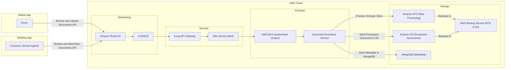
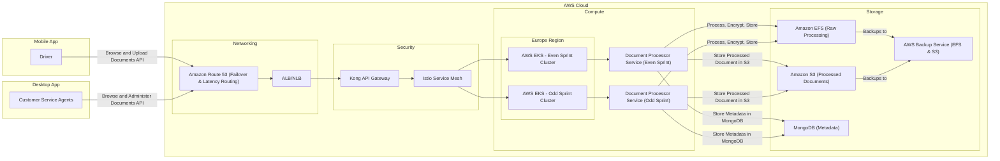

## **🥜 Proposed Architecture for the Document Processor System**

| **Challenge**                  | **Proposed Solution**                                                                                                                                                                                                                                            |
|--------------------------------|------------------------------------------------------------------------------------------------------------------------------------------------------------------------------------------------------------------------------------------------------------------|
| **Scalability & Performance**  | ✅ Migrate to **AWS EKS** for Kubernetes-based auto-scaling (**Karpenter**)   ✅ Use **RabbitMQ** for asynchronous processing |
| **Traffic Control & Routing**  | ✅ Use **Amazon Route 53** for **failover & latency-based routing** |
| **Storage & Data Security**    | ✅ Store documents in **Amazon S3** for processed data   ✅ Use **Amazon EFS** for raw image processing   ✅ **Encrypt documents** for security and compliance |
| **Security & Compliance**      | ✅ Implement **Kong API Gateway** with **OAuth plugin** for authentication & rate limiting   ✅ Enhance security using **Istio Service Mesh** for service-to-service communication   ✅ Use **Kyverno** for policy enforcement and **AWS Secret Manager** for secrets management |
| **Reliability & Fault Tolerance** | ✅ Use **Route 53 failover** for high availability   ✅ Implement **AWS Backup Service** for S3 & EFS backups |
| **Deployment & Release Risks** | ✅ Adopt **Canary & Blue-Green Deployments** using **ArgoCD** for GitOps-driven deployments |
| **Containerization & Portability** | ✅ **Dockerize applications** for consistency across environments   ✅ Deploy containers using **Amazon EKS** for managed **Kubernetes orchestration** |
| **Service Mesh & Observability** | ✅ Integrate **Istio Service Mesh** for traffic management, security, and observability   ✅ Implement **full observability** using **ELK, Instana, Prometheus, and Grafana** |

---

### **📞 Architecture Diagram**

#### **Approach 1 (Single EKS Cluster with Istio Service Mesh)**

#### **Approach 2 (Dual EKS Clusters per Sprint with Istio Service Mesh)**

---

### **📊 Feature Comparison**

| **Feature**                     | **Approach 1 (Single EKS Cluster with Istio)** | **Approach 2 (Dual EKS Clusters with Istio per Sprint)** |
|----------------------------------|--------------------------------------------|---------------------------------------------|
| **Traffic Control**              | ✅ Amazon Route 53 (low cost)              | ✅ Amazon Route 53 (low cost)               |
| **Load Balancing**               | ✅ AWS ALB/NLB (scalable, pay-as-you-go) | ✅ AWS ALB/NLB (scalable, pay-as-you-go)   |
| **Security**                     | ✅ Kong API Gateway with OAuth (moderate cost) | ✅ Kong API Gateway with OAuth (higher due to 2 clusters) |
| **Compute (Execution Environment)** | ✅ Single AWS EKS Cluster (scalable, efficient cost) | ✅ Two AWS EKS Clusters (double EKS cost) |
| **Deployment Strategy**          | ✅ ArgoCD + Argo Rollouts (low additional cost) | ✅ ArgoCD (low cost, no Argo Rollouts) |
| **Scalability (Karpenter)** | ✅ Kubernetes-based auto-scaling (efficient cost) | ✅ Kubernetes-based auto-scaling (higher cost due to 2 clusters) |
| **Async Processing**             | ✅ RabbitMQ (low cost per message processed) | ✅ Separate RabbitMQ per cluster (higher due to duplication) |
| **Observability**                | ✅ ELK, Instana, Prometheus, Grafana       | ✅ ELK, Instana, Prometheus, Grafana       |
| **Cost Consideration 💰**        | 💲 **Optimized (Single EKS, scalable, moderate cost)** | 💲💲 **Higher (2x EKS clusters, better isolation)** |

---

