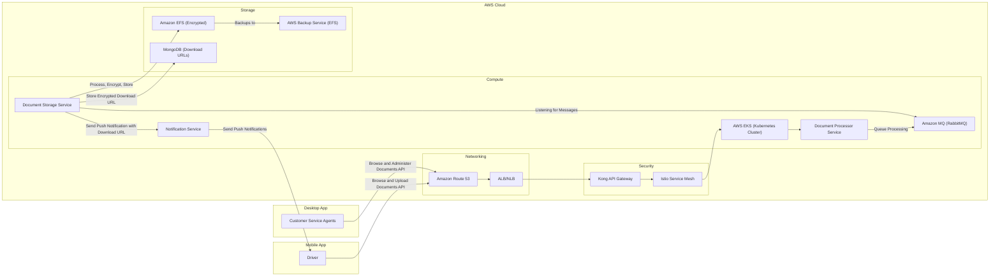
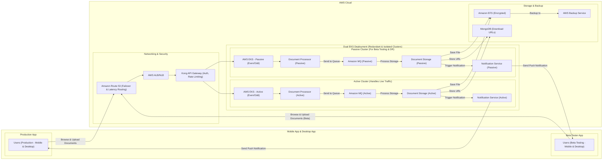

## **🦜 Proposed Architecture for the Document Processor System**

| **Challenge**                  | **Proposed Solution**                                                                                                                                                                                                                                            |
|--------------------------------|------------------------------------------------------------------------------------------------------------------------------------------------------------------------------------------------------------------------------------------------------------------|
| **Scalability & Performance**  | ✅ Migrate to **AWS EKS** for Kubernetes-based auto-scaling (**Karpenter**)   ✅ Use **RabbitMQ** for asynchronous processing |
| **Traffic Control & Routing**  | ✅ Use **Amazon Route 53** for **failover & latency-based routing** |
| **Storage & Data Security**    | ✅ Store documents in **Amazon EFS** (scalable, low latency)   ✅ **Encrypt documents** for security and compliance |
| **Security & Compliance**      | ✅ Implement **Kong API Gateway** for authentication & rate limiting |
| **Reliability & Fault Tolerance** | ✅ Use **Route 53 failover** for high availability   ✅ Implement **AWS Backup Service** for EFS backups |
| **Deployment & Release Risks** | ✅ Adopt **Canary & Blue-Green Deployments** for safer rollouts and minimal downtime |
| **Containerization & Portability** | ✅ **Dockerize applications** for consistency across environments   ✅ Deploy containers using **Amazon EKS** for managed **Kubernetes orchestration** |
| **Service Mesh & Observability** | ✅ Integrate **Istio Service Mesh** for traffic management, security, and observability |
| **Mobile Notifications**       | ✅ Add **NotificationService** to send notifications to the mobile app via **Firebase Cloud Messaging (FCM)** |

---

### **📞 Architecture Diagram**

#### **Single EKS Cluster with Istio Service Mesh**

---

### **Process Flow**

1. **Drivers & Agents** interact with the system through **Amazon Route 53** and **Kong API Gateway**.
2. **Document Processor Service** receives document upload requests and pushes processing tasks to **Amazon MQ (RabbitMQ)**.
3. **Document Storage Service** listens for messages from **Amazon MQ**, processes documents, encrypts them, and stores them in **Amazon EFS**.
4. **Document Storage Service** stores the encrypted document’s **download URL** in **MongoDB**.
5. Once the document is stored, **Document Storage Service** sends a push notification to the mobile app via **Firebase Cloud Messaging (FCM)**.
6. Users receive a notification with a **download link** to access the stored document.
7. **AWS Backup Service** ensures periodic backups of **Amazon EFS** for disaster recovery.

---

### **✅ Key Benefits**

- **Highly Scalable**: Uses **Kubernetes auto-scaling** via **AWS EKS** and **Karpenter**.
- **Efficient Traffic Management**: Powered by **Amazon Route 53**, **ALB**, and **Istio Service Mesh**.
- **Secure & Compliant**: Encryption, **Kong API Gateway**, and **EFS encryption** ensure data security.
- **Reliable & Fault-Tolerant**: Uses **Amazon MQ** for async processing, **AWS Backup Service** for redundancy.
- **Mobile-Friendly**: Supports **Firebase Cloud Messaging** for instant user notifications.

---

#### ** Dual EKS Clusters per Sprint with Istio Service Mesh **

✅ **Multi-cluster redundancy (Even/Odd Sprints)** for resilience  
✅ **Disaster recovery preparedness** (If one EKS fails, traffic shifts)  
✅ **Internal testing of new releases** by routing the Mobile & Desktop App to the passive EKS cluster

### **Key Takeaways**
- **Active EKS Cluster** handles live traffic
- **Passive EKS Cluster** allows **staging & disaster recovery**
- **Failover mechanism**: If Active EKS fails, Route 53 shifts traffic
- **Testing & Validation**: Internal app users can test on Passive Cluster

---
