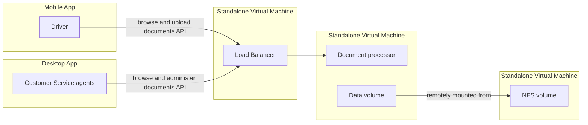

# SRE Architecture Test

Thank you very much (again!) for your interest in the Site Reliability
Engineer position at Cabify. We really appreciate the effort you took on
delivering the Code Test.

Get yourself comfortable and make sure to double check the test requirements.

You will have two weeks of time to complete the test. We would normally
expect you to work on this no more than 2-3 hours, but you probably have other
things to do in your life so we want to give you plenty of time in case you want
to take on the challenge. If you don't, then it's perfectly fine. Just please
let us know if this is the case.

If you have any questions about anything, please do not hesitate to ask us: better safe than sorry!

Looking forward to seeing the results. Good luck!

### Problem

At Cabify, we need to gather some specific documentation from our Drivers in order
to comply with the law (IDs, car's licence plates, etc). These documents are managed
on a later stage by our Customer Service agents.

In order to handle and store these documents, we have a `Document processor` application that
is used by both Drivers (via mobile phone) and Customer Service agents (via web browser).

The `Document processor` application consists of three different parts:

- A backend service implementing an API
- A specific UI within the Cabify mobile applications that talk to the backend's API
- An internal UI for our Customer Service team that talk to the backend's API

Our Drivers numbers are increasing quickly as the company lands on many different
countries, and we are starting to have some problems with the current setup, so we
need to anticipate them and make sure we help the development team owning this application
in the best possible way.

As a SRE, your main goal will be revamping the whole system and designing a new one that
is more up-to-date, resilient, scalable and easy to operate, so we will be able to minimise
all possible risk and focus on some other important business needs.

### Current architecture diagram

Some additional points about the diagram and its tiers (to simplify):

- User Tier
    - We have hundreds of thousands of `Drivers`.
    - `Drivers` can see and upload their own documents.
    - We have thousands of `Customer Service agents`.
    - `Agents` can administer all `Drivers` documents: read, delete and upload new documents.
- Load Balancer Tier
    - `Load Balancer` has a public `IP` on The Internet, networking details are ommited.
    - `Load Balancer` has a single `backend` service: the `Document processor` application.
- Application Tier
    - The `Document processor` application converts the raw images received into two different
      kinds: low resolution and high resolution images (for mobile and desktop applications, respectively).
    - All images are stored within a local data directory, which is remotely mounted on the host
      via `NFS`.
    - The `upload` process is a synchronous operation, so request times may take longer to
      complete on slower networks.
    - The images are read from disk by the `Document processor` when any of them is retrieved by
      any of the applications.
- Storage Tier
    - The File Server VM host sole purpose is storing Driver's documents.
    - Data redundancy is achieved via configured `RAID 1` with two mirrored SATA hard drives.

### Tasks

- Provide a `solution.md` file in this very same repository and work on the steps defined below:
    1. Identify the bottlenecks and potential risks of the current approach and explain why.
    2. Work on improving the current architecture:
        - Design and provide a new architecture diagram (hint: you can use [GitLab's diagrams feature](https://docs.gitlab.com/ee/user/markdown.html#diagrams-and-flowcharts-using-mermaid)
          to avoid using some other 3rd party tools).
        - Explain the benefits of the new approach and how it solves the prior bottlenecks identified.
    3. Elaborate what would be your action plan to execute this new project, considering:
        - You would need to engage with different teams, and each of these teams' cooperation
          may vary according to human factors and their own roadmap goals.
        - You would need to rollout these changes without affecting the ongoing operations of
          both Drivers and Agents.

### Additional considerations
- Please elaborate your answers as much as you can, try to focus on the high-level aspect
  of the platform you are designing.
- You can suggest specific technologies to be used as a replacement for the components above.
  If that is the case, please specify why. Enumerating specific technologies to use is not mandatory,
  you can still suggest any other abstract approach. We are more interested in getting to know
  your train of thought :-).
- Feel free to add additional tiers to the design as you need them.
